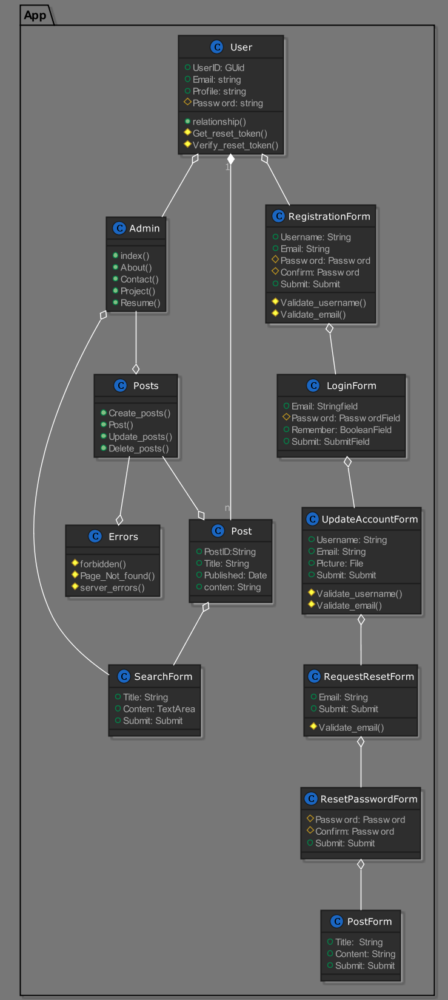

# Portfolio-project

## Run To config
```
docker-compose config
```
## Run To build
```
docker-compose build
```
## Run To rebuild
```
docker-compose up --build
docker-compose up -d  
```
## Run To stop 
```
docker-compose stop
```
## Run To remove
```
docker-compose rm
docker-compose down
```
<<<<<<< HEAD

## Image for Plantuml 
```
Plantuml Class Diagram
```


=======
>>>>>>> 8d706fd55f85dceea7c7333065c7e1d5fe4abce9
